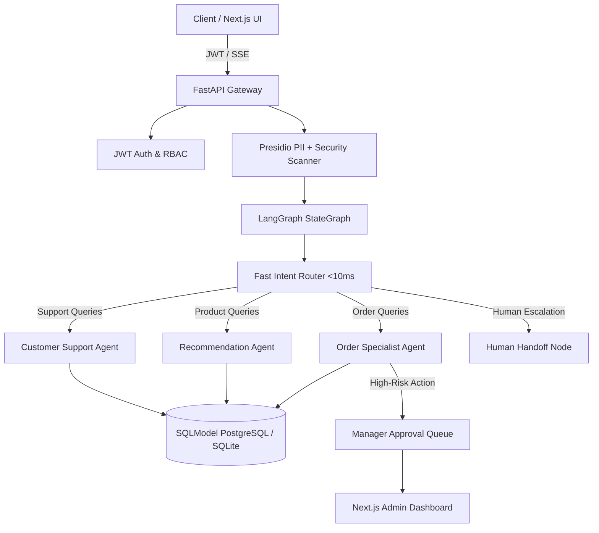

# Aisle v2: Enterprise Multi-Agent AI E-Commerce Platform

A production-grade, state-driven multi-agent AI e-commerce platform built with **LangGraph**, **FastAPI**, **SQLModel/PostgreSQL**, and **Next.js**. 

Aisle v2 addresses real-world enterprise engineering challenges: **sub-millisecond intent routing**, **persistent database state**, **Human-in-the-Loop (HITL) manager approvals**, **Microsoft Presidio NLP PII redaction**, and **JWT authentication**.

---

## 🌟 Why Aisle v2? (Portfolio Showcase Highlights)

Unlike basic AI chatbot wrappers that rely on in-memory state and single system prompts, Aisle v2 is architected for production reliability:

1. **Sub-millisecond Routing (<10ms):** Replaced heavy 70B LLM supervisor overhead with fast pattern intent classification for common queries (order tracking, product search, human requests).
2. **Persistent Checkpoints & Async Database:** Replaced in-memory Python dictionaries with SQLModel (Async SQLAlchemy) supporting PostgreSQL (`asyncpg`) and SQLite (`aiosqlite`).
3. **Human-in-the-Loop (HITL) Approval Queue:** High-risk agent actions (such as order cancellations or refunds) automatically pause execution and queue up in the Admin Dashboard for manager approval.
4. **Enterprise Guardrails & PII Protection:** Integrated **Microsoft Presidio Analyzer & Anonymizer** for context-aware PII detection (Email, Phone, SSN, Credit Cards, IP addresses) plus prompt-injection security scanners.
5. **JWT Authentication & RBAC:** Complete auth system (`/auth/register`, `/auth/login`, `/auth/me`) ensuring users can only access or modify their own order histories and profiles.
6. **Graceful Human Escalation:** Instead of hard-crashing when budget limits or edge-cases occur, the state graph seamlessly transfers the session to a `human_handoff` live support queue.

---

## 🏗️ System Architecture



---

## 🚀 Quick Start (One-Command Docker Setup)

The entire platform (PostgreSQL, FastAPI Backend, Next.js Frontend) can be launched with a single command:

```bash
# 1. Clone repository
git clone https://github.com/Saumojit30/Aisle.git
cd Aisle

# 2. Configure Environment
cp .env.example .env
# Edit .env and set your GROQ_API_KEY

# 3. Spin up entire platform
docker compose up --build
```

Access the applications at:
- **Next.js Storefront & Admin Dashboard:** [http://localhost:3000](http://localhost:3000)
- **FastAPI API & OpenAPI Docs:** [http://localhost:8080/docs](http://localhost:8080/docs)

---

## 🛠️ Local Python & Node Setup

If running locally without Docker:

```bash
# 1. Python Environment
python -m venv .venv
# Windows: .venv\Scripts\activate | macOS/Linux: source .venv/bin/activate
pip install -e ".[dev]"

# 2. Initialize & Seed Database
python -m app.db.seed

# 3. Start FastAPI Server
uvicorn app.main:app --reload --port 8080
```

In a separate terminal for Frontend:

```bash
cd frontend
npm install
npm run dev
```

---

## 📖 API Reference Highlights

| Method | Endpoint | Description | Auth Required |
|---|---|---|---|
| `POST` | `/auth/register` | Register a new user & receive JWT token | No |
| `POST` | `/auth/login` | OAuth2 password login & receive JWT token | No |
| `GET` | `/auth/me` | Retrieve authenticated user profile | Yes (Bearer) |
| `POST` | `/chat` | Send message to AI Agent Graph | Optional |
| `GET` | `/chat/stream` | Real-time SSE event stream for pipeline viz | Optional |
| `GET` | `/admin/approvals` | List pending Human-in-the-Loop manager approval tasks | Admin |
| `POST` | `/admin/approvals/{id}/respond` | Approve or reject a high-risk agent action | Admin |
| `GET` | `/products` | List products from SQLModel database | No |
| `GET` | `/orders` | List orders from SQLModel database | No |

---

## 🔬 Testing

Run unit and integration tests covering Authentication, Presidio PII redaction, Supervisor Routing, and Database models:

```bash
pytest tests/ -v
```

---

## 📄 License

MIT
