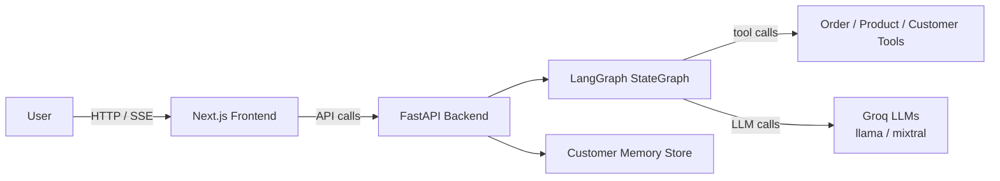
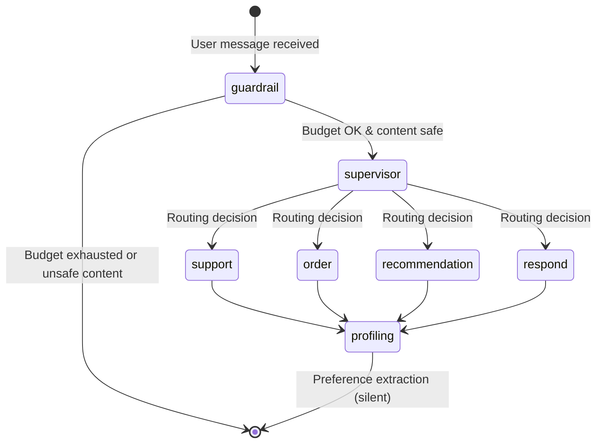
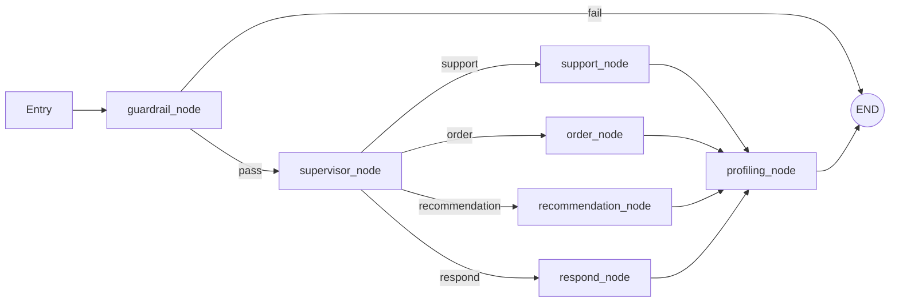

# Aisle

Multi-agent AI e-commerce assistant built with **LangGraph**, **FastAPI**, and **Next.js**. Uses a directed graph of specialized LLM agents (powered by Groq) to handle product recommendations, order management, and general support — with built-in budget guardrails and content security.

## Features

- **Multi-agent architecture** — role-specialized agents for support, orders, recommendations, and casual responses
- **Intelligent routing** — supervisor LLM routes each query to the right specialist agent
- **Budget & cost controls** — per-session and daily token/cost caps with rate limiting and hard-stop enforcement
- **PII redaction** — automatic detection and redaction of emails, phones, SSNs, and credit card numbers
- **Sensitive topic filtering** — blocks unsafe or disallowed content before it reaches the LLM
- **Silent customer profiling** — extracts preferences and interests from conversations to build customer profiles
- **SSE streaming** — real-time event stream with pipeline node/tool call visibility
- **Admin dashboard** — budget gauges, cost charts, customer profiles, and analytics

## Architecture



## Workflow



### Node Flow Detail



## Tech Stack

| Layer | Technology |
|---|---|
| **Backend** | Python 3.11+, FastAPI, LangGraph, LangChain, Pydantic, Uvicorn |
| **LLMs** | Groq (llama-3.3-70b, llama-3.1-8b, mixtral-8x7b) |
| **Frontend** | Next.js 16, React 19, TypeScript, Tailwind CSS v4 |
| **State** | Zustand (client), LangGraph StateGraph + MemorySaver (server) |
| **UI** | Radix UI, @xyflow/react (pipeline viz), Framer Motion |
| **Infrastructure** | Docker, Google Cloud Run, Google Cloud Build |

## Project Structure

```
aisle/
├── app/
│   ├── main.py                 # FastAPI app factory + lifespan
│   ├── api.py                  # REST + SSE endpoints
│   ├── config.py               # Pydantic Settings (env vars)
│   ├── agents/
│   │   ├── supervisor.py       # LLM-based routing agent
│   │   ├── support_agent.py    # Customer support (returns/refunds)
│   │   ├── recommendation_agent.py  # Product recommendations
│   │   ├── order_agent.py      # Order management
│   │   └── profiling_agent.py  # Silent preference extraction
│   ├── tools/
│   │   ├── product_tools.py    # Catalogue search, details, inventory
│   │   ├── order_tools.py      # Order status, tracking, cancel, history
│   │   └── customer_tools.py   # Profile lookup, purchase summary
│   ├── graph/
│   │   ├── state.py            # AgentState TypedDict
│   │   └── graph.py            # Node functions + graph build + routing
│   ├── memory/
│   │   └── customer_memory.py  # In-memory customer profiling store
│   └── security/
│       ├── content_filter.py   # PII redaction + sensitive topic detection
│       └── budget_controller.py # Per-session + daily cost/token tracking
├── frontend/
│   └── src/
│       ├── app/                # Next.js pages
│       ├── components/         # Chat, pipeline viz, dashboard, UI
│       ├── hooks/              # SSE streaming hook
│       └── stores/             # Zustand chat store
├── tests/
│   └── test_graph.py           # Unit tests (budget, filter, tools, guards)
├── deploy/
│   └── cloud_run.yaml          # Cloud Run service manifest
├── Dockerfile                  # Container image
├── cloudbuild.yaml             # Cloud Build CI/CD
├── pyproject.toml              # Python project metadata
├── requirements.txt            # Production deps
└── requirements-dev.txt        # Dev deps
```

## Prerequisites

- Python 3.11+
- Node.js 20+
- A [Groq API key](https://console.groq.com)

## Quick Start

```bash
# 1. Clone and set up Python environment
git clone <repo-url>
cd aisle
python -m venv .venv
.venv\Scripts\activate    # Windows
# source .venv/bin/activate  # macOS/Linux

# 2. Install backend dependencies
pip install -e ".[dev]"

# 3. Configure environment
cp .env.example .env
# Edit .env and set GROQ_API_KEY

# 4. Start the backend
uvicorn app.main:app --reload
```

In a separate terminal:

```bash
# 5. Install and start the frontend
cd frontend
npm install
npm run dev
```

Open http://localhost:3000 to access the chat interface.

## Configuration

All configuration is via environment variables (see `.env.example`).

| Variable | Default | Description |
|---|---|---|
| `GROQ_API_KEY` | — | Groq API key (required) |
| `SUPERVISOR_MODEL` | `llama-3.3-70b-versatile` | Model for routing decisions |
| `SUPPORT_MODEL` | `llama-3.1-8b-instant` | Model for support agent |
| `RECOMMENDATION_MODEL` | `llama-3.3-70b-versatile` | Model for recommendation agent |
| `ORDER_MODEL` | `mixtral-8x7b-32768` | Model for order agent |
| `PROFILING_MODEL` | `llama-3.1-8b-instant` | Model for silent profiling |
| `MAX_DAILY_COST` | `10.0` | Daily budget cap (USD) |
| `MAX_SESSION_COST` | `2.0` | Per-session budget cap (USD) |
| `MAX_TOKENS_PER_SESSION` | `50000` | Token limit per session |
| `MAX_REQUESTS_PER_MINUTE` | `30` | Rate limit per session |
| `HARD_STOP_ENABLED` | `true` | Hard block when budget exhausted |
| `HOST` | `0.0.0.0` | Server bind address |
| `PORT` | `8080` | Server port |

## API Reference

| Method | Path | Description |
|---|---|---|
| `POST` | `/chat` | Send a message, get reply + budget info |
| `GET` | `/chat/stream` | SSE stream with real-time node/tool events |
| `GET` | `/products` | List all products |
| `GET` | `/products/{id}` | Product details |
| `GET` | `/orders` | List all orders |
| `GET` | `/orders/{id}` | Order details |
| `GET` | `/memory/customers` | List profiled customers |
| `GET` | `/memory/customers/{id}` | Customer profile with preferences |
| `GET` | `/health` | Health check |
| `GET` | `/budget/{session_id}` | Session budget status |
| `GET` | `/admin/stats` | Combined budget + memory stats |

## Graph Details

The LangGraph `StateGraph` defines 7 nodes with conditional routing:

| Node | Function | Model | Tools |
|---|---|---|---|
| **guardrail** | Budget check + PII redaction + sensitive topic filter | — (rule-based) | — |
| **supervisor** | LLM-decides which specialist to route to | `llama-3.3-70b` | — |
| **support** | Customer support (returns, refunds, complaints) | `llama-3.1-8b` | `get_order_status`, `track_shipment`, `cancel_order` |
| **order** | Order management & tracking | `mixtral-8x7b` | `get_order_status`, `track_shipment`, `cancel_order`, `get_order_history` |
| **recommendation** | Product search & recommendations | `llama-3.3-70b` | `search_catalogue`, `get_product_details`, `check_inventory` |
| **respond** | Simple replies (greetings, thanks, farewells) | `llama-3.1-8b` | — |
| **profiling** | Silent side-effect: extract customer preferences | `llama-3.1-8b` | — (writes to `CustomerMemory`) |

### Agent State

The `AgentState` TypedDict flows through the graph:

| Field | Type | Description |
|---|---|---|
| `messages` | `List[BaseMessage]` | Chat history (appended via reducer) |
| `session_id` | `str` | Unique conversation session ID |
| `customer_id` | `Optional[str]` | Identified customer (if known) |
| `routing_decision` | `str` | Supervisor output: `support` / `order` / `recommendation` / `respond` |
| `budget_ok` | `bool` | Did budget check pass? |
| `budget_message` | `Optional[str]` | Denial message if budget failed |
| `guardrail_fail` | `bool` | Did guardrail block the request? |
| `guardrail_message` | `Optional[str]` | Reason for guardrail block |

## Security & Budget Controls

**BudgetController** — Thread-safe singleton tracking costs per-session and per-day:
- Cost estimation based on Groq's per-model input/output pricing
- `can_proceed()` checks daily cap, session cap, token limit, and rate limit
- `record_usage()` deducts from budgets after each LLM call
- `hard_stop_enabled` returns a friendly denial message instead of crashing

**ContentFilter** — Regex-based security layer:
- PII redaction: emails, phone numbers, SSNs, credit card numbers
- Sensitive topic detection: passwords, hacking, exploits, and other disallowed content
- Returns both redacted text and a safety flag

## Testing

```bash
pytest tests/ -v
```

Tests cover budget controller logic, content filtering, order/product/customer tools, and guardrail routing.

## Deployment

### Docker

```bash
docker build -t aisle .
docker run -p 8080:8080 --env-file .env aisle
```

### Google Cloud Run

```bash
gcloud builds submit --config cloudbuild.yaml
gcloud run deploy aisle \
  --image gcr.io/$(gcloud config get-value project)/aisle \
  --platform managed \
  --region us-central1
```

## License

MIT
