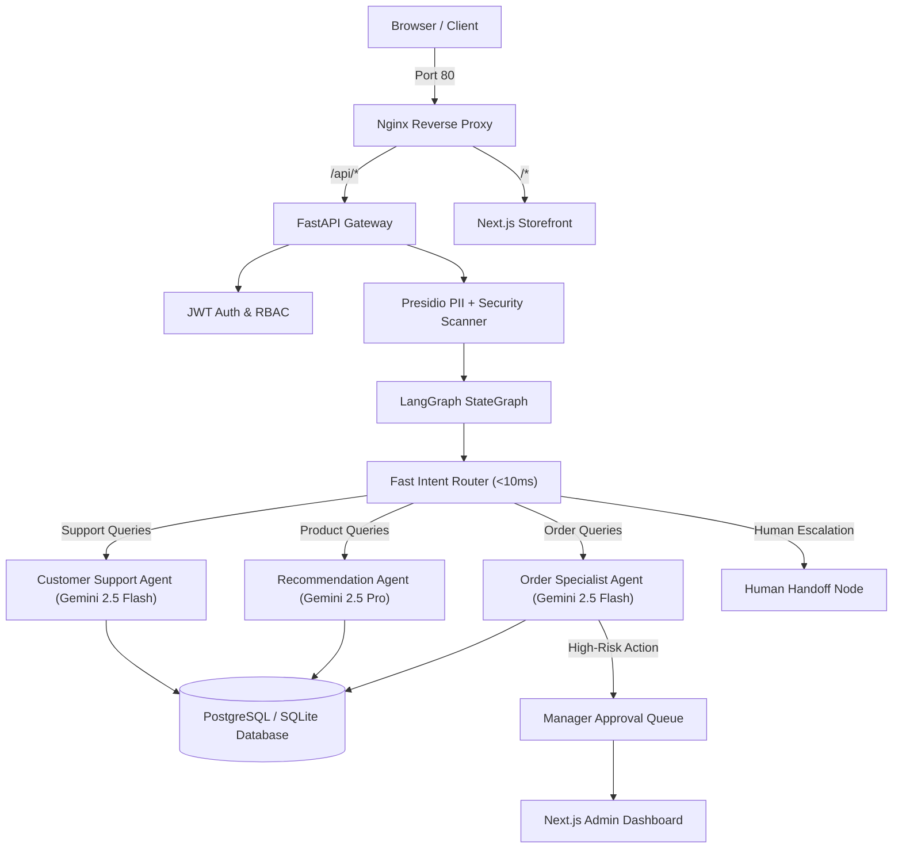

# Aisle: Enterprise Multi-Agent AI E-Commerce Platform

A production-grade, state-driven multi-agent AI e-commerce platform built with **LangGraph**, **FastAPI**, **SQLModel/PostgreSQL**, **Next.js**, and powered by **Google Gemini** models.

Aisle addresses real-world enterprise engineering challenges: **ingress routing via Nginx Reverse Proxy**, **hybrid routing (Google Gemini + fast-path regex)**, **persistent database state**, **Human-in-the-Loop (HITL) manager approvals**, **Microsoft Presidio NLP PII redaction**, **JWT authentication**, and a **dynamic LLM provider factory**.

---

## 🌟 Core Features (Portfolio Showcase Highlights)

Unlike basic AI chatbot wrappers that rely on in-memory state and single system prompts, Aisle is architected for production reliability:

1. **Enterprise Ingress & Nginx Gateway:** Unified routing under a single port (port 80) via Nginx. Prevents CORS issues, hides backend services from the public internet, handles EventSource SSE buffering for streaming nodes, and provides clean request logging.
2. **Dual-Core LLM Provider Factory:** Native integration with **Google Gemini** (`gemini-2.5-pro` and `gemini-2.5-flash`) via `langchain-google-genai`, with seamless fallback/support for **Groq** (`llama-3.3-70b-versatile`, etc.) depending on configuration.
3. **Sub-millisecond Routing (<10ms):** Replaced heavy LLM supervisor routing overhead with fast pattern intent classification for common queries (order tracking, product search, human requests). Falls back to Gemini for nuanced queries.
4. **Persistent Checkpoints & Async Database:** Replaced in-memory Python dictionaries with SQLModel (Async SQLAlchemy) supporting PostgreSQL (`asyncpg`) and SQLite (`aiosqlite`).
5. **Human-in-the-Loop (HITL) Approval Queue:** High-risk agent actions (such as order cancellations or refunds) automatically pause execution and queue up in the Admin Dashboard for manager approval.
6. **Enterprise Guardrails & PII Protection:** Integrated **Microsoft Presidio Analyzer & Anonymizer** for context-aware PII detection (Email, Phone, SSN, Credit Cards, IP addresses) plus prompt-injection security scanners.
7. **JWT Authentication & RBAC:** Complete auth system (`/auth/register`, `/auth/login`, `/auth/me`) ensuring users can only access or modify their own order histories and profiles.
8. **Graceful Human Escalation:** Instead of hard-crashing when budget limits or edge-cases occur, the state graph seamlessly transfers the session to a `human_handoff` live support queue.

---

## 🏗️ System Architecture



---

## 🔍 Detailed Component Walkthrough

### 1. Ingress & Proxy Gateway (Nginx)
The environment runs behind an **Nginx reverse proxy** container.
*   **Unified Access:** The proxy container exposes port `80` to the host, acting as the only public entry point.
*   **Routing Rules:**
    *   `/*` (Root & Static files): Proxied internally to `aisle_frontend:3000`.
    *   `/api/*`: Strips prefix and proxies internally to `aisle_backend:8080/`.
    *   `/docs`, `/redoc`, `/openapi.json`: Proxied directly to FastAPI API documentation.
*   **SSE Support (EventSource):** Special proxy headers are injected to turn off proxy buffering (`proxy_buffering off;`) for `/api/chat/stream`, ensuring real-time LangGraph event streaming is not delayed or chunked.

### 2. Guardrails, Safety & PII (Microsoft Presidio)
Before a user message enters the agent graph, the **Content Filter** runs pre-flight security checks:
*   **PII Anonymization:** Uses the **Microsoft Presidio Analyzer and Anonymizer** engine (NLP-based) to identify and redact sensitive entities (Emails, Phone Numbers, Credit Cards, Social Security Numbers, IP addresses) and replaces them with clean tags (e.g. `[EMAIL_ADDRESS_REDACTED]`).
*   **Jailbreak & Prompt Injection Filter:** Runs fuzzy string matching and regex checks against known injection signatures to block attempts to override the system instructions.
*   **Budget Controller:** Tracks tokens used and costs calculated per model (Gemini 2.5 vs Groq). If the daily budget ($10.00) or session budget ($2.00) is exceeded, it gracefully refuses automated execution and transfers the user to a live support ticket.

### 3. State-Driven Routing & Specialist Agents (LangGraph)
Aisle uses a structured `StateGraph` state machine to model the user session:
*   **Supervisor Router:** A custom routing node that first runs a high-speed keyword regex check to route queries under 10ms. If the query is ambiguous, it falls back to a Gemini 2.5 Pro LLM router to select the appropriate specialist agent (`support`, `order`, `recommendation`, `respond`, or `human_handoff`).
*   **Specialist Agents:** React-style agents equipped with tool groups to fetch/modify database records:
    *   `order_agent` uses tools for checking order status, tracking shipments, cancelling orders, and fetching purchase histories.
    *   `recommendation_agent` uses tools for searching the product catalogue, checking inventory levels, and retrieving details.
    *   `support_agent` assists with refund policies and general issues.
    *   `profiling_agent` runs silently on every turn to extract and update user preferences.

### 4. Human-in-the-Loop (HITL) Handoff
For operations that represent financial or operational risk (such as order cancellations or custom refunds):
*   The agent graph transitions to a paused/approval state.
*   A transaction task is pushed to the `PendingApproval` SQLModel queue.
*   The Next.js Admin Dashboard uses the `/admin/approvals` endpoints to display the request.
*   A human manager can approve or deny the action, resuming graph execution with the choice injected back into the state.

---

## 🤖 Gemini & LLM Configuration

The project utilizes a dynamic model factory (`llm_factory.py`) that decides whether to run a Google Gemini model or a Groq Llama/Mixtral model based on the configuration inside your `.env` file.

### Default Gemini Model Allocations:
*   **Supervisor Router:** `gemini-2.5-pro` (handles complex routing logic)
*   **Recommendation Specialist:** `gemini-2.5-pro` (handles detailed reasoning for matches)
*   **Order Specialist:** `gemini-2.5-flash` (fast, structured task executor)
*   **Customer Support Agent:** `gemini-2.5-flash` (empathetic, quick responses)
*   **Silent Profile Extractor:** `gemini-2.5-flash` (JSON data mining)

---

## 🚀 Quick Start (One-Command Docker Setup)

The entire platform (Nginx Proxy, PostgreSQL, FastAPI Backend, Next.js Frontend) can be launched with a single command:

```bash
# 1. Clone repository
git clone https://github.com/Saumojit30/Aisle.git
cd Aisle

# 2. Configure Environment
cp .env.example .env
# Edit .env and set your GEMINI_API_KEY (and/or GROQ_API_KEY)
```

**Required environment variables in `.env`:**
```ini
# Add your Gemini API key (from Google AI Studio)
GEMINI_API_KEY=AIzaSy...

# Optional: Add Groq API Key if using Llama models
# GROQ_API_KEY=gsk_...
```

```bash
# 3. Spin up entire platform
docker compose up --build
```

Access the applications at:
- **Next.js Storefront & Admin Dashboard:** [http://localhost](http://localhost) (No port needed! Served over standard port 80 via Nginx)
- **FastAPI API & OpenAPI Docs:** [http://localhost/docs](http://localhost/docs)

---

## 🛠️ Local Python & Node Setup

If running locally without Docker:

```bash
# 1. Python Environment
python -m venv .venv
# Windows: .venv\Scripts\activate | macOS/Linux: source .venv/bin/activate
pip install -e ".[dev]"

# 2. Initialize & Seed Database
python -m app.db.seed

# 3. Start FastAPI Server
uvicorn app.main:app --reload --port 8080
```

In a separate terminal for Frontend:

```bash
cd frontend
npm install
npm run dev
```

---

## 📖 API Reference Highlights

| Method | Endpoint | Description | Auth Required |
|---|---|---|---|
| `POST` | `/auth/register` | Register a new user & receive JWT token | No |
| `POST` | `/auth/login` | OAuth2 password login & receive JWT token | No |
| `GET` | `/auth/me` | Retrieve authenticated user profile | Yes (Bearer) |
| `POST` | `/chat` | Send message to AI Agent Graph | Optional |
| `GET` | `/chat/stream` | Real-time SSE event stream for pipeline viz | Optional |
| `GET` | `/admin/approvals` | List pending Human-in-the-Loop manager approval tasks | Admin |
| `POST` | `/admin/approvals/{id}/respond` | Approve or reject a high-risk agent action | Admin |
| `GET` | `/products` | List products from SQLModel database | No |
| `GET` | `/orders` | List orders from SQLModel database | No |

---

## 🔬 Testing

Run unit and integration tests covering Authentication, Presidio PII redaction, Supervisor Routing, and Database models:

```bash
python -m pytest tests/ -v
```

---

## 📄 License

MIT
